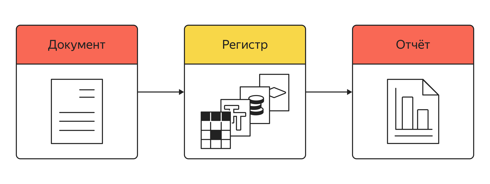

# ТЕМА: Регистры
ДАТА: 2026-03-23

## Источники:
- Яндекс.Практикум, курс "Разработчик 1С"

## Основные сведения
Регистры в системе 1С:Предприятие предназначены для хранения информации о состоянии разных показателей. Регистры, в отличие от справочников и документов, — это **необъектные данные**.

Регистр можно представить себе как таблицу, где каждая строка хранит данные об определённой операции.

Регистры бывают четырёх видов:
* **Регистры сведений** позволяют хранить произвольные данные и указывать объекты, к которым эти данные относятся.
* **Регистры накопления** позволяют собирать информацию о фактах хозяйственной деятельности организации.
* **Регистры бухгалтерии** похожи на регистры накопления, но используются для регламентированного учёта. Они умеют рассчитывать итоги по плану счетов, который содержит правила ведения бухгалтерского учёта в организации. Эти регистры обеспечивают учёт ресурсов и обязательств по принципам бухгалтерии и позволяют получать остатки и обороты по счетам на конкретную дату.
* **Регистры расчёта** применяются в ещё более узкой нише, чем регистры бухгалтерии. Они предназначены для сложных периодических вычислений. В первую очередь их используют для расчёта зарплаты, но они подойдут и для вычисления стоимости аренды или лизинговых платежей. Как регистр бухгалтерии связан с планом счетов, так и регистр расчёта привязан к плану видов расчёта.

## Регистры сведений
Регистры сведений позволяют хранить в системе произвольные данные с указанием объектов, к которым эти данные относятся.

Информация в регистре сведений хранится в виде записей. Для каждой записи указывается:
* **Измерение (разрез)**: указание, к каким объектам относятся данные. Примеры — товар, склад, контрагент.
* **Ресурс**: какие именно данные хранятся в регистре. Примеры — количество, сумма.
* **Реквизит**: дополнительная информация. Примеры — вид хозяйственной операции, комментарий.

В отличие от объектов документа или справочника, у записей нет уникального идентификатора. Уникальность записей в регистре контролируется по ключу записи.

**Ключ записи** — это совокупность измерений каждой записи. Во время записи в регистр система проверяет значение ключа и не позволит создать две записи с одинаковыми значениями полей. При этом если у двух записей значение хотя бы в одном поле отличается, то обе будут считаться уникальными, и система их сохранит.

Регистр сведений хранит данные не только в разрезе заданных измерений, но и в разрезе времени. Отсюда возникают варианты периодичности:
* **Непериодический** регистр сведений — такой, в котором **данные не зависят от времени**. Например, регистр сведений «Штрихкоды номенклатуры» содержит перечень штрихкодов без привязки к дате их возникновения или действия.
* **Периодический** регистр сведений (в пределах дня, в пределах месяца, в пределах года и прочее) фиксирует дату. Например, регистр сведений «Цены номенклатуры» содержит цену для каждой номенклатуры с указанием даты начала действия цены.

Изменения в регистр сведений могут вноситься в двух режимах:
* **Независимый режим записи**.

    Записи в регистр вручную вносит ответственный пользователь. Например, в регистр сведений «Штрихкоды номенклатуры» пользователь может внести записи из карточки номенклатуры.
* **Подчинён регистратору.**

    **Регистратор** — это документ, проведение которого служит основанием для создания записи в регистре.

    **В подчинённом регистратору** режиме записи все изменения в регистре сведений жёстко связаны с документами, фиксирующими факты хозяйственной деятельности. Это означает, что для внесения изменений в регистр должен быть создан какой-то объект (например, накладная или какой-то ещё документ), и при проведении этого объекта в регистр будет внесена новая запись.

## Регистр накопления
Назначение регистров накопления — учёт движения ресурсов: например, финансов, материалов или товаров.

Цель регистра — накапливать информацию о разных процессах в компании:

* о движении денег (как об их приходе, так и об их расходе) — регистр накопления «Денежные средства»;
* о движении товарно-материальных ценностей (их поступлении, перемещении внутри компании, продаже или списании) — регистр накопления «Товары»;
* о задолженности (кто должен нам и кому должны мы) — регистр накопления «Взаиморасчёты»;
* о расходах — регистр накопления «Прочие расходы» и тому подобное. Регистры накопления — основной механизм оперативного учёта.

По потребности в итоговой информации различают два вида регистров накопления:
* **Регистры накопления остатков.** В таких регистрах накопления для хранимой информации допустимо понятие остатка на начало и конец периода. Например: в регистре накопления остатков «Денежные средства» приход средств увеличивает остаток, а расход — уменьшает. В конце дня получается остаток на конец дня, который в то же время будет остатком на начало следующего дня.
* **Регистры накопления оборотов.** Это регистры накопления, в которых для хранимой информации отсутствует понятие остатка и интерес представляют только обороты. Пример — регистр накопления «Прочие расходы», когда пользователя в общем порядке интересует, сколько потратили за период: за день, в этом месяце, за квартал, в этом году. Понятие «остаток расходов на начало года» в этом случае смысла не несёт, потому что у регистра нет остатка. Или: регистр накопления оборотов «Закупки» хранит объёмы и суммы закупок по поставщикам, номенклатуре, складам и организациям, но не фиксирует остатки товаров или итоговую задолженность перед поставщиком на дату.
В отличие от регистра сведений, который может быть не подчинён регистратору, все регистры учёта условно можно назвать «подчинёнными регистратору»: записи не могут быть внесены без привязки к регистратору.

### Структура регистра накопления

Регистр накопления — система, которая состоит из измерений, ресурсов и реквизитов. Измерения регистра описывают разрезы, в которых хранится информация. В ресурсах регистра накапливаются нужные числовые данные, а реквизиты служат для дополнительной информации.

* Для регистра накопления «Денежные средства» измерением может быть расчётный счёт, потому что пользователя интересует остаток по каждому расчётному счёту отдельно. А ресурсом — сумма, то есть остаток в рублях.
* Для регистра накопления «Товары» измерением может быть номенклатура: в этом случае интересует остаток каждой номенклатуры отдельно, а не абстрактное количество всего подряд. Ресурсом может быть количество (остаток в штуках) и сумма (стоимость в рублях).
* Для регистра накопления «Взаиморасчёты» измерение — это контрагент, потому что пользователя интересуют долги по каждому контрагенту отдельно. Ресурсом могут быть суммы в рублях и валюте.
* Для регистра накопления «Прочие расходы» измерением будет статья расходов: тут важно, сколько потратили по каждой статье отдельно. А ресурсом — сумма, то есть сколько потратили в рублях.

Для каждой записи указываются:
* измерения: с каким именно объектом проводится операция;
* ресурсы: на сколько именно изменяются числовые данные;
* регистратор: каким документом регистрируется изменение;
* реквизиты: что дополнительно нужно зафиксировать для записи.

## Связь документов и регистров
Документы и регистры в 1С тесно связаны между собой и образуют единую систему. Документы — это первичные учётные объекты, которые фиксируют конкретные хозяйственные операции.

Информация из созданных пользователем документов во время проведения записывается в регистрах. Это формирует учётные данные. В дальнейшем по данным из регистров строятся отчёты.

Часть документов в системе может быть запрещена к проведению — такое тоже бывает. Создание такого документа не приведёт к появлению новых записей в регистрах.

> Задача отчёта — выбрать из регистра данные в наглядном виде. А задача документа — поместить данные в регистр в соответствии с внутренней логикой платформы 1С.

